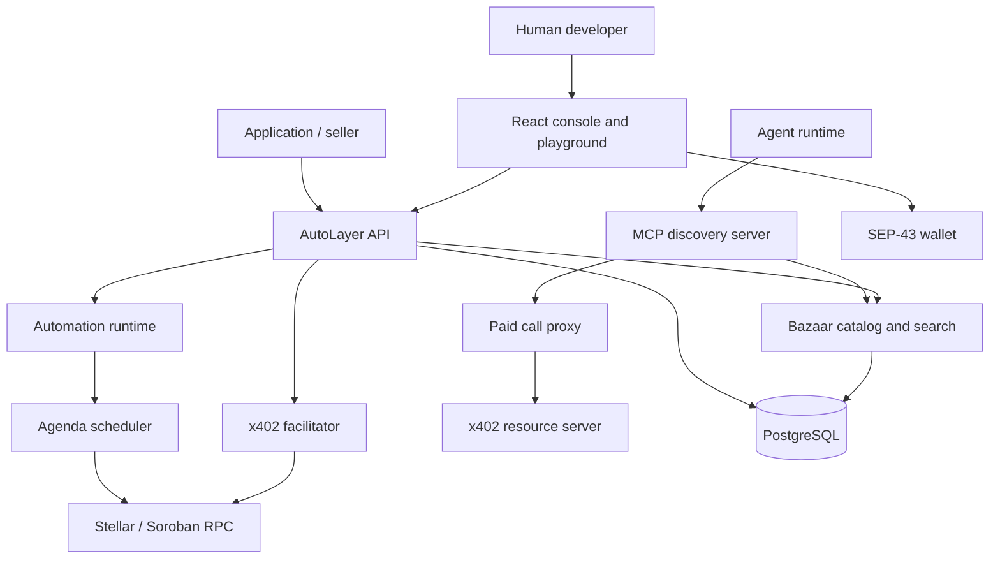
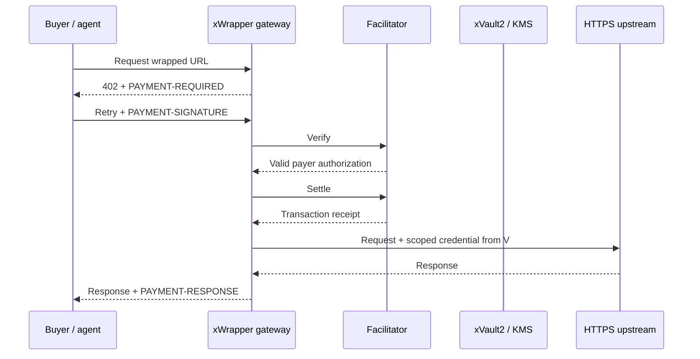
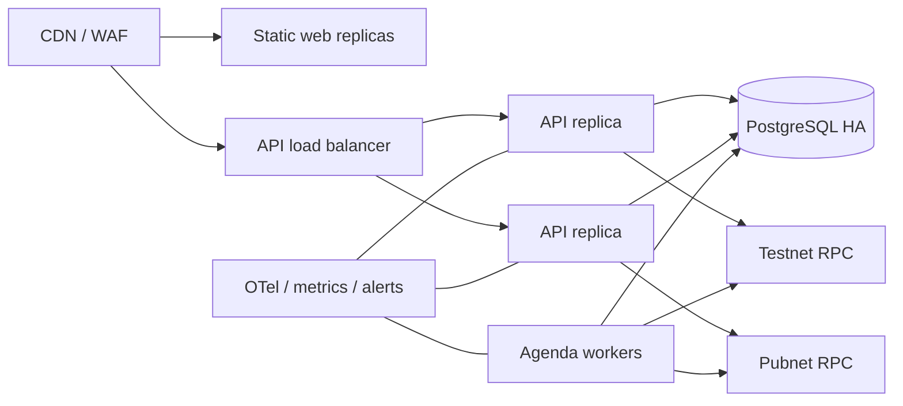

## System objective

AutoLayer is an execution plane between applications or agents and Stellar, Soroban, and paid HTTPS services. It removes RPC, XDR construction, transaction simulation, fee sponsorship, payment negotiation, and service discovery from the caller-facing interface while preserving wallet authorization and non-custodial fund ownership.



## Repository layout

```text
autolayer-core/
├── apps/
│   ├── api/                 Express API, facilitator, scheduler, Bazaar, MCP
│   └── web/                 React + TypeScript + Tailwind site and console
├── packages/
│   └── sdk/                 Published TypeScript client
├── examples/
│   └── autolayer-keeper/    Soroban automation interface example
├── docs/                    Mintlify documentation
└── docker-compose.yml       Local PostgreSQL and API topology
```

## Web application

`apps/web` is a Vite-built React single-page application. The same artifact supports the public site and console deployment:

- `autolayer.fi` serves product pages and `/playground`.
- `console.autolayer.fi` redirects `/` to `/console`.
- `VITE_API_URL` selects the API origin at build time.

The console contains live API-backed screens for wallet identity/API keys, automations, facilitator capabilities, Bazaar resources, Agent Skills, xWrapper deployments, xVault2 metadata, request logs, payments, and usage analytics. Browser wallet code never receives a secret key. Classic transaction helpers build envelopes locally with `@stellar/stellar-sdk`, request signatures through Stellar Wallets Kit, reconstruct signed envelopes, and submit to Horizon.

Wallet integration uses the v2 static API from `@creit-tech/stellar-wallets-kit`. The kit is initialized once with `defaultModules()`, connection uses `authModal()`, reload restoration uses `getAddress()`, and signing uses `signTransaction()` or `signAuthEntry()`. Before each signature AutoLayer calls `setNetwork()` with the explicitly selected testnet or pubnet passphrase. Wallets without SEP-43 auth-entry support may connect and sign Classic transactions but cannot complete x402 Soroban authorization signing.

## API process

`apps/api/src/index.ts` configures the process in this order:

1. Security headers with Helmet.
2. Configurable CORS origins.
3. A 256 KB JSON body limit.
4. Structured Pino request logs.
5. Canonical x402 middleware for the paid example.
6. Automation, facilitator, discovery, skills, and MCP routers.
7. A centralized non-leaking error handler.
8. PostgreSQL connectivity, Agenda handler registration, and scheduler startup.
9. Graceful SIGINT/SIGTERM shutdown of Agenda and PostgreSQL.

Environment validation uses Zod and fails closed before listening. Cryptographic key material is loaded only by the API process.

## x402 facilitator

The facilitator is composed with `x402Facilitator` from `@x402/core` and `ExactStellarScheme` from `@x402/stellar/exact/facilitator`. AutoLayer does not maintain a private fork of exact verification.

Two explicit registrations are created:

```text
exact + stellar:testnet
exact + stellar:pubnet
```

Both advertise `extra.areFeesSponsored: true`. A configurable maximum transaction fee is a safety ceiling. The payment relayer signs and submits the facilitator-built invocation; the buyer signs Soroban authorization entries rather than a prebuilt settlement transaction.

### Standard endpoints

| Method | Path | Responsibility |
| --- | --- | --- |
| `GET` | `/supported` | Return registered version, scheme, CAIP-2 networks, extension keys, fee sponsorship, and signers |
| `POST` | `/verify` | Validate canonical `paymentPayload` against `paymentRequirements` without transferring funds |
| `POST` | `/settle` | Re-verify, simulate, submit, wait for confirmation, and return the transaction result |

The body is the canonical object:

```json
{
  "paymentPayload": {},
  "paymentRequirements": {}
}
```

Every invalid response is normalized with a non-null machine-readable reason. Exact settlement validates the authorization structure, expiration ledger, token contract, amount, recipient, transfer event, and signature status through the upstream Stellar implementation.

### Network behavior

Testnet uses the upstream default Soroban RPC. Pubnet uses `STELLAR_MAINNET_RPC_URL`. Stellar identifiers are never inferred from the API environment. A payment explicitly selects one CAIP-2 network.

The facilitator account requires XLM for inclusion and resource fees. Buyers require the payment asset but do not require XLM when fees are sponsored. Recipients of issued Classic assets must establish the relevant trustline; SEP-41 contract-account behavior depends on the token implementation.

## Bazaar discovery

Discovery metadata is declared by resource servers with `declareDiscoveryExtension` and transported in the x402 v2 extension block. AutoLayer uses `extractDiscoveryInfo(..., true)` from `@x402/extensions/bazaar` for schema and protocol validation.

Cataloging occurs only after successful settlement. A verify-only request cannot write to the catalog. The result is returned in a base64-encoded `EXTENSION-RESPONSES` header so sellers can distinguish successful cataloging from a soft drop.

HTTP resources are keyed by URL. MCP resources are keyed by the tuple `resource URL + tool name`. The PostgreSQL row stores:

- Resource key, URL, and `http` or `mcp` type
- MCP tool name when applicable
- x402 version
- Description, MIME type, service name, and tags
- Accepted payment requirements as JSONB
- Echoed extension data and validated discovery information as JSONB
- Last update timestamp
- A generated weighted full-text search vector

`GET /discovery/resources` supports type, `payTo`, scheme, network, extension, limit, and offset. `GET /discovery/search` uses `websearch_to_tsquery` and `ts_rank_cd`, orders equal scores by freshness, fetches one additional row to calculate `partialResults`, and returns an opaque base64url cursor.

<Warning>
Before an unrestricted public launch, catalog ownership needs an additional origin-control mechanism so an economically motivated payer cannot create the first listing for a URL it does not control. Successful settlement prevents free poisoning but does not by itself prove DNS or origin ownership.
</Warning>

## Agent and skills interface

`POST /mcp` implements JSON-RPC initialization, `tools/list`, and `tools/call`. The current tools are:

- `search_services`: natural-language Bazaar search with network and limit inputs.
- `paid_call`: forwards a caller-provided x402 payment signature to an HTTPS resource already present in the catalog.

All tool failures contain structured JSON-RPC codes and a non-null `data.reason`. Paid calls accept HTTPS only, require an exact catalog match, apply a 30-second timeout, and return the upstream status, response body, and `PAYMENT-RESPONSE` receipt.

`GET /v1/skills` supports intent, protocol, network, and action filters. `GET /v1/skills/:slug/spec` returns a versioned contract with authentication mode, action input/output schemas, safety requirements, and deterministic retry semantics so an agent does not need Stellar CLI, RPC, XDR, or SDK knowledge.

## Automation runtime

Automation proposals are persisted in PostgreSQL and scheduled through Agenda's PostgreSQL backend. The domain supports generic typed Soroban contract calls, DCA, rebalancing, and disbursement policy proposals. A proposal creates a fresh delegate keypair, derives a deterministic policy identifier, encrypts delegate material with AES-GCM and contextual additional authenticated data, prices the requested finite run count, and returns wallet session-creation material. Generic calls bind the wallet session to the exact contract and function; the contract must enforce argument-sensitive financial invariants.

Lifecycle states distinguish proposal, payment, activation, active execution, pause, completion, cancellation, failure, and expiration. Jobs are registered before Agenda starts. Run limits and wallet session authorization limits are stored separately because one scheduled disbursement can consume multiple transfer authorizations.

The Soroban convention is:

```rust
pub trait AutoLayerKeeper {
    fn autolayer_check(env: Env) -> bool;
    fn autolayer_run(env: Env, executor: Address) -> Val;
}
```

Contracts must still enforce authorization, replay protection, permitted windows, and financial invariants. The scheduler is not a security boundary.

## xWrapper gateway

xWrapper is a first-class AutoLayer Gateway feature, not another name for the facilitator. Its target request path is:



### Implementation

Wrapper and vault records are owner-scoped in PostgreSQL. Operator keys are compared as SHA-256 digests with constant-time equality; the derived owner identifier is stored instead of the key. Vault values use AES-256-GCM with a unique nonce, authenticated context containing the secret ID, and key-version enforcement.

The public proxy emits canonical x402 v2 `PAYMENT-REQUIRED`, decodes `PAYMENT-SIGNATURE`, verifies and settles through `@x402/stellar`, then returns `PAYMENT-RESPONSE`. Enabled wrappers are upserted into the off-chain Bazaar and removed on disable or deletion.

Outbound targets must use HTTPS. Userinfo, loopback, link-local, private, reserved, `.local`, and `.internal` targets are rejected. Every resolved address must be public, the chosen address is pinned into the TLS connection, redirects are rejected, sensitive and hop-by-hop headers are stripped, and request/response size and time limits are enforced.

Rate and monthly quota counters use atomic PostgreSQL upserts so limits hold across multiple API replicas. Request logs and settlement records power the Console analytics view.

### Remaining launch gates

External KMS custody for `KEY_ENCRYPTION_MASTER_KEY`, secret rotation UI, retention jobs for quota/audit tables, circuit breaking, penetration testing, external security review, and live mainnet conformance evidence remain operational release gates.

## Data protection and keys

Automation delegate keys are encrypted at rest using a 32-byte master key and versioned encryption metadata. The payment relayer and automation paymaster must be separate funded accounts. Environment validation rejects reuse of the same secret.

Production should replace static environment secrets with workload identity and KMS-backed secret retrieval. Key rotation must retain decryption support for prior ciphertext versions until data is rewrapped. Logs must redact payment signatures, authorization XDR, secrets, and authorization headers.

## Deployment topology



Run migrations as a single pre-deploy job. API replicas may scale horizontally. Agenda locking and PostgreSQL advisory locks coordinate scheduled work. Settlement throughput should use multiple channel signers or fee-bump separation to avoid a single account sequence bottleneck. The upstream Stellar facilitator supports signer selection and a separate fee-bump signer; production configuration should use those facilities rather than sharing one sequence source under burst load.

## Availability and degraded modes

- If PostgreSQL is unavailable, readiness fails and mutating endpoints stop.
- If a Stellar RPC is degraded, the corresponding network is unavailable; the other network must remain independently observable.
- Verify failure never falls through to resource delivery.
- Settlement timeout is indeterminate, not a safe retry signal. Reconciliation must query transaction state before resubmission.
- Bazaar search can remain read-only during settlement degradation.
- Scheduler jobs use bounded retries and record the last error; terminal financial errors require operator review.

## Observability

Production instrumentation should expose request latency and error rate by route, verification rejection reason, settlement duration and outcome by network, RPC simulation/send latency, signer sequence utilization, Agenda queue depth and lock age, automation run outcome, Bazaar indexing soft-drop reasons, search latency and zero-result rate, and paid-call upstream latency.

Alerts should cover elevated invalid-reason rates, settlement confirmation timeout, low paymaster XLM balance, signer sequence contention, database saturation, scheduler lag, and catalog write failures.

## Implementation status

| Capability | Status | Notes |
| --- | --- | --- |
| Public website and console | Implemented | Production build and SPA deployment configuration |
| Classic XLM transaction | Implemented | Stellar Wallets Kit signing; testnet and pubnet |
| Automation persistence and scheduler | Implemented | Generic contract call, DCA, rebalance, disbursement domain |
| x402 exact facilitator | Implemented | Upstream `@x402/stellar`, both networks |
| Sponsored settlement | Implemented | Configurable fee ceiling |
| Bazaar catalog/list/search | Implemented MVP | Ownership proof and search evaluation remain production-hardening work |
| MCP search and paid proxy | Implemented MVP | Caller provides payment signature |
| Skills catalog and spec preview | Implemented MVP | Versioned static registry with filters, action schemas, safety and retry semantics |
| xWrapper multi-tenant gateway | Implemented MVP | Persistent proxy, x402 settlement, Bazaar, quotas, audit and analytics; external review remains |
| xVault2 | Implemented MVP | AES-256-GCM persistence and scoped injection; KMS custody/rotation remain launch gates |
| Stellar `upto` | Not advertised | Requires upstream specification, implementation, contract decision, tests, and review |

This table is the source of truth for product claims. A successful TypeScript build is not equivalent to a mainnet conformance run or security review.
