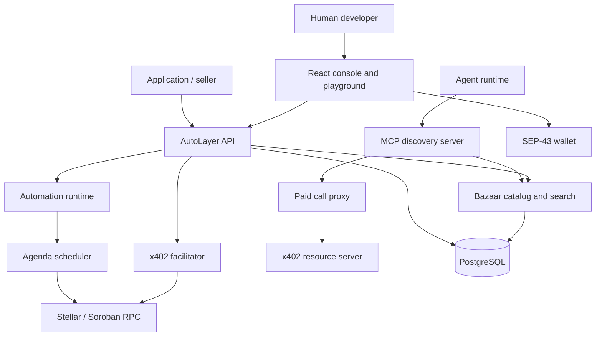
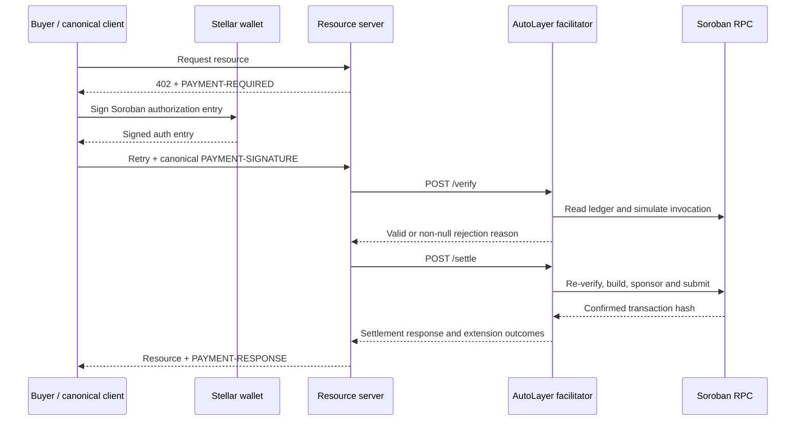
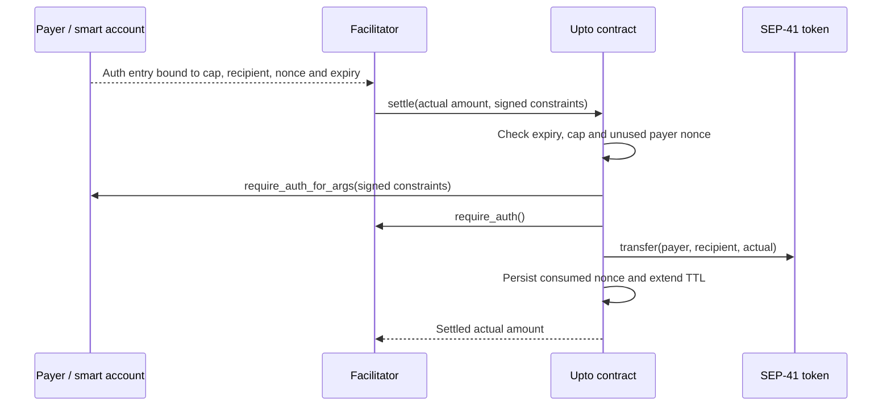
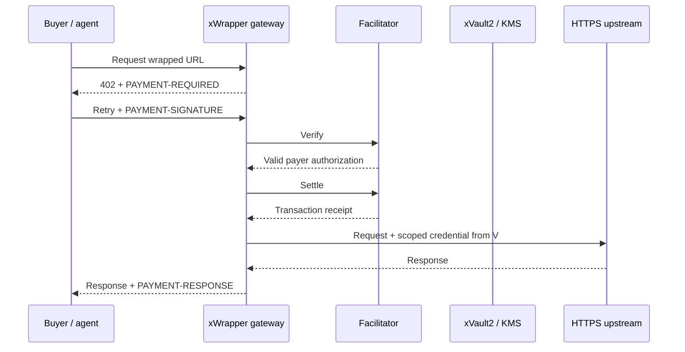
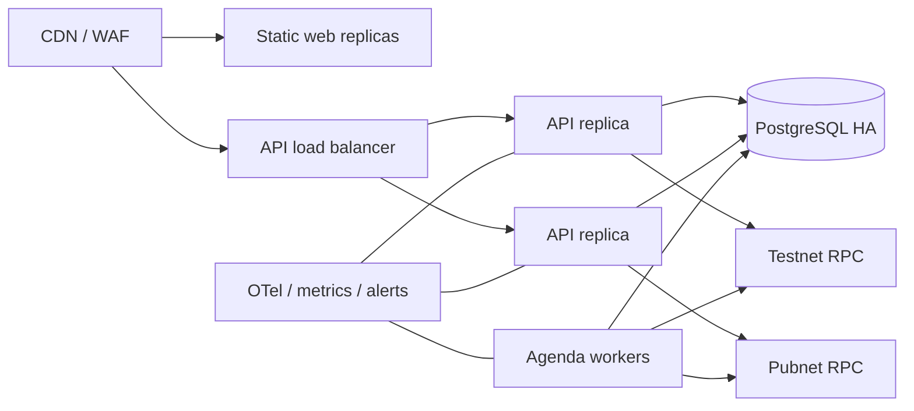

## System objective

AutoLayer is an execution plane between applications or agents and Stellar, Soroban, and paid HTTPS services. It removes RPC, XDR construction, transaction simulation, fee sponsorship, payment negotiation, and service discovery from the caller-facing interface while preserving wallet authorization and non-custodial fund ownership.



## RFP delivery boundary and Stellar integration

This architecture directly addresses the **X402 Facilitator with Bazaar (Discovery) Support** RFP. The grant boundary is the x402 facilitator, Stellar-native Bazaar, MCP agent interface, Stellar `upto` contribution, SDKs, examples, conformance, security hardening, and production operation. AutoLayer's broader automation runtime remains available to the product but is not used to inflate the RFP scope or budget.

The working MVP is deliberately separated from grant acceptance:

| Capability | Demonstrated foundation | Grant-period production completion |
| --- | --- | --- |
| Exact facilitator | `@x402/stellar` registered for both CAIP-2 networks; stock-client testnet settlement published | Hosted testnet and pubnet, canonical e2e suite on both, public hashes and operational SLOs |
| Bazaar | HTTP/MCP schema, filters, ranked search and native post-settlement cataloging implemented | Origin integrity, larger evaluation corpus, interoperability fixtures and production indexing |
| MCP | Structured search and signature-forwarding paid call implemented | Wallet adapters, full discover/pay/retry examples, load and failure-mode validation |
| `upto` | Draft network profile and non-custodial Soroban prototype deployed on testnet | TSC review, upstream adapters/fixtures, audit remediation and both-network conformance |
| xWrapper/xVault2 | Persistent gateway, AES-256-GCM credential storage, quotas and analytics implemented | KMS custody, rotation, retention, circuit breaking and external review |
| Security | Threat boundaries, hostile catalog tests and dependency-license gate implemented | Audit Bank review, findings remediation, penetration tests and mainnet production gate |

### Selected building blocks

| Building block | AutoLayer integration | Why it is used |
| --- | --- | --- |
| `@x402/core` | Canonical v2 client, facilitator, payload and response contracts | Prevents an AutoLayer-specific wire format |
| Apache-2.0 `@x402/stellar` | Exact client and facilitator schemes for `stellar:testnet` and `stellar:pubnet` | Composes the maintained Stellar settlement implementation instead of reimplementing it |
| `@x402/extensions/bazaar` | Seller declarations, extraction and schema validation | Keeps Stellar listings interoperable with the wider x402 discovery ecosystem |
| `@stellar/stellar-sdk` and Soroban RPC | Simulation, auth-entry construction, submission, confirmation and reconciliation | Uses Stellar-native authorization and resource accounting |
| Stellar Wallets Kit / SEP-43 | Explicit-network transaction and Soroban auth-entry signing | Supports browser wallets without handing keys to AutoLayer |
| SEP-41 Stellar Asset Contracts | USDC by default and any compatible token in integer base units | Supports stablecoin micropayments while preserving seven-decimal accounting |
| CAIP-2 | `stellar:testnet` and `stellar:pubnet` on every requirement and payload | Prevents implicit or ambiguous network selection |
| MCP | Deterministic catalog search and paid-call tools | Makes discovery and purchase available inside agent runtimes |
| PostgreSQL | Default off-chain catalog, search index, quotas and audit metadata | Avoids Soroban rent and a second transaction on the exact-payment hot path |
| AutoLayer `upto` Soroban contract | Recipient-bound, cap-enforcing and nonce-consuming metered settlement | SEP-41 allowances alone cannot guarantee recipient binding or single settlement |

The runtime dependency graph excludes the AGPL OpenZeppelin Relayer, its x402 plugin, and its SDK. The repository is Apache-2.0 and the dependency gate inventories reachable production packages before release.

## Repository layout

```text
autolayer-core/
├── apps/
│   ├── api/                 Express API, facilitator, scheduler, Bazaar, MCP
│   └── web/                 React + TypeScript + Tailwind site and console
├── packages/
│   └── sdk/                 Published TypeScript client
├── contracts/
│   └── upto-settlement/     Non-custodial Soroban metered settlement contract
├── specs/
│   └── schemes/upto/        Draft Stellar network profile for upstream review
├── examples/
│   └── autolayer-keeper/    Soroban automation interface example
├── docs/                    Mintlify documentation
└── docker-compose.yml       Local PostgreSQL and API topology
```

## Web application

`apps/web` is a Vite-built React single-page application. The same artifact supports the public site and console deployment:

- `autolayer.fi` serves product pages and `/playground`.
- `console.autolayer.fi` redirects `/` to `/console`.
- `VITE_API_URL` selects the API origin at build time.

The console contains live API-backed screens for wallet identity/API keys, automations, facilitator capabilities, Bazaar resources, Agent Skills, xWrapper deployments, xVault2 metadata, request logs, payments, and usage analytics. Browser wallet code never receives a secret key. Classic transaction helpers build envelopes locally with `@stellar/stellar-sdk`, request signatures through Stellar Wallets Kit, reconstruct signed envelopes, and submit to Horizon.

Wallet integration uses the v2 static API from `@creit-tech/stellar-wallets-kit`. The kit is initialized once with `defaultModules()`, connection uses `authModal()`, reload restoration uses `getAddress()`, and signing uses `signTransaction()` or `signAuthEntry()`. Before each signature AutoLayer calls `setNetwork()` with the explicitly selected testnet or pubnet passphrase. Wallets without SEP-43 auth-entry support may connect and sign Classic transactions but cannot complete x402 Soroban authorization signing.

## API process

`apps/api/src/index.ts` configures the process in this order:

1. Security headers with Helmet.
2. Configurable CORS origins.
3. A 256 KB JSON body limit.
4. Structured Pino request logs.
5. Canonical x402 middleware for the paid example.
6. Automation, facilitator, discovery, skills, and MCP routers.
7. A centralized non-leaking error handler.
8. PostgreSQL connectivity, Agenda handler registration, and scheduler startup.
9. Graceful SIGINT/SIGTERM shutdown of Agenda and PostgreSQL.

Environment validation uses Zod and fails closed before listening. Cryptographic key material is loaded only by the API process.

## x402 facilitator

The facilitator is composed with `x402Facilitator` from `@x402/core` and `ExactStellarScheme` from `@x402/stellar/exact/facilitator`. AutoLayer does not maintain a private fork of exact verification.

Two explicit registrations are created:

```text
exact + stellar:testnet
exact + stellar:pubnet
```

Both advertise `extra.areFeesSponsored: true`. A configurable maximum transaction fee is a safety ceiling. The payment relayer signs and submits the facilitator-built invocation; the buyer signs Soroban authorization entries rather than a prebuilt settlement transaction.

### Standard endpoints

| Method | Path | Responsibility |
| --- | --- | --- |
| `GET` | `/supported` | Return registered version, scheme, CAIP-2 networks, extension keys, fee sponsorship, and signers |
| `POST` | `/verify` | Validate canonical `paymentPayload` against `paymentRequirements` without transferring funds |
| `POST` | `/settle` | Re-verify, simulate, submit, wait for confirmation, and return the transaction result |

The body is the canonical object:

```json
{
  "paymentPayload": {},
  "paymentRequirements": {}
}
```

Every invalid response is normalized with a non-null machine-readable reason. Exact settlement validates the authorization structure, expiration ledger, token contract, amount, recipient, transfer event, and signature status through the upstream Stellar implementation.

### Exact authorization and settlement flow



The buyer signs a Soroban authorization entry, not a pre-signed transaction. The canonical base64 `PaymentPayload` carries the upstream Stellar `payload: { transaction }` form verbatim. Verification binds the signature to the declared invocation tree, CAIP-2 network, SEP-41 token contract, integer amount, recipient and ledger expiration. Classic `G...` accounts use native signatures; custom contract accounts execute their `__check_auth` policy.

`maxTimeoutSeconds` is converted to a bounded `signatureExpirationLedger` using current ledger cadence. Values use SEP-41 integer base units: seven decimal places means one unit is `0.0000001` token and no floating-point arithmetic is permitted. Seller onboarding checks that Classic recipients have the required trustline before advertising an issued asset.

Settlement repeats all security-critical verification after simulation, enforces the configured resource-fee ceiling, submits through a dedicated fee-paying signer, waits for a final transaction result and returns its hash. Tampering changes the authorized invocation and fails signature validation. Expired authorizations fail closed. Production replay protection records authorization/transaction identities and confirmed outcomes; a timeout is reconciled against Stellar before any resubmission so an indeterminate result cannot become a double charge.

### Network behavior

Testnet uses the upstream default Soroban RPC. Pubnet uses `STELLAR_MAINNET_RPC_URL`. Stellar identifiers are never inferred from the API environment. A payment explicitly selects one CAIP-2 network.

The facilitator account requires XLM for inclusion and resource fees. Buyers require the payment asset but do not require XLM when fees are sponsored. Recipients of issued Classic assets must establish the relevant trustline; SEP-41 contract-account behavior depends on the token implementation.

## Stellar `upto` settlement

Metered services cannot know the final price when authorization is created. AutoLayer therefore proposes a Soroban contract-backed Stellar `upto` scheme rather than relying only on SEP-41 `approve` and `transfer_from`, which cannot independently guarantee recipient binding and single settlement.

The current draft is in `specs/schemes/upto/scheme_upto_stellar.md`, with a testnet contract in `contracts/upto-settlement`. The payer authorizes a tuple containing the domain, CAIP-2 network, contract address, payer, token, fixed recipient, maximum amount, nonce, expiration ledger and facilitator. The actual amount is supplied at capture time, must be non-negative and no greater than the maximum, and is transferred directly from payer to recipient. The contract never takes custody.



The consumed `(payer, nonce)` key prevents replay and is retained with a TTL beyond the authorization's validity window. The contract records no balance and adds no registry write to exact payments. Soroban simulation, instruction/memory/read/write ceilings and state-rent monitoring are required release checks. Smart accounts can add daily caps, token allowlists, approved facilitator/recipient sets and per-call limits inside `__check_auth` while preserving the protocol tuple.

Grant-period integration includes finalizing the network specification with the x402 Technical Steering Committee, contributing client/facilitator adapters and fixtures to the upstream package, resolving review feedback, publishing deployments and settled hashes on testnet and pubnet, and completing contract/off-chain security review. AutoLayer will not advertise production `upto` support until those gates pass. Batch settlement and auth-capture remain explicitly compatible phase-two extensions and are outside this grant.

## Bazaar discovery

Discovery metadata is declared by resource servers with `declareDiscoveryExtension` and transported in the x402 v2 extension block. AutoLayer uses `extractDiscoveryInfo(..., true)` from `@x402/extensions/bazaar` for schema and protocol validation.

Cataloging occurs only after successful settlement. A verify-only request cannot write to the catalog. The result is returned in a base64-encoded `EXTENSION-RESPONSES` header so sellers can distinguish successful cataloging from a soft drop.

HTTP resources are keyed by URL. MCP resources are keyed by the tuple `resource URL + tool name`. The PostgreSQL row stores:

- Resource key, URL, and `http` or `mcp` type
- MCP tool name when applicable
- x402 version
- Description, MIME type, service name, and tags
- Accepted payment requirements as JSONB
- Echoed extension data and validated discovery information as JSONB
- Last update timestamp
- A generated weighted full-text search vector

`GET /discovery/resources` supports type, `payTo`, scheme, network, extension, limit, and offset. `GET /discovery/search` uses `websearch_to_tsquery` and `ts_rank_cd`, orders equal scores by freshness, fetches one additional row to calculate `partialResults`, and returns an opaque base64url cursor.

<Warning>
Before an unrestricted public launch, catalog ownership needs an additional origin-control mechanism so an economically motivated payer cannot create the first listing for a URL it does not control. Successful settlement prevents free poisoning but does not by itself prove DNS or origin ownership.
</Warning>

### Catalog integrity

Discovery processing is a soft-drop side effect: invalid metadata never changes payment settlement, but it is rejected from the catalog and its machine-readable outcome is returned through `EXTENSION-RESPONSES`. Validation checks the schema advertised by the extension, rejects unsupported external references, binds catalog payment terms to the successfully settled requirements, and never trusts client-echoed pricing independently.

`routeTemplate` is percent-decoded before traversal and normalization checks, so encoded `..`, separators and ambiguous paths cannot bypass validation. HTTP identity is the normalized resource URL; MCP identity is the required tuple of resource URL and `input.toolName`. The production origin-control layer will use an HTTPS challenge or signed well-known document, with renewal and conflict rules, before allowing a listing to claim a public origin.

### Search quality and evaluation

The MVP uses PostgreSQL weighted full-text retrieval: service name and tags receive greater weight than descriptions and parameter text, ranking uses `ts_rank_cd`, and freshness is only a deterministic tie-breaker. Cursor pagination fetches one extra result to set `partialResults` accurately.

A checked-in relevance set currently exercises ten natural-language queries over twelve representative resources. The recorded local baseline is nDCG@10 `0.9983`, MRR `1.0000`, recall@10 `1.0000`, with p95 query latency reported separately from ranking quality. During the grant this becomes a versioned, larger and adversarial corpus covering HTTP and MCP resources, misspellings, intent synonyms, network/asset filters and zero-result queries. CI will fail on agreed regression thresholds; production dashboards will track p50/p95 latency, zero-result rate and clicked/paid outcomes. Hybrid lexical/vector retrieval may be introduced only when measured results justify its operational cost.

### Conformance upkeep and interoperability

AutoLayer stores Bazaar data in the canonical x402 resource shape instead of a Stellar-only projection. Seller helpers emit per-parameter descriptions and the standard extension; buyer helpers consume the same pagination and resource fields used by other facilitators.

The team will monitor x402 Foundation specification changes and Technical Steering Committee decisions, pin reviewed package versions, run scheduled compatibility tests against upstream main, and update fixtures when endpoint shapes, filters or cataloging rules evolve. Each release will include a wire-level diff review and cross-facilitator fixture run. This maintenance commitment continues through the grant period and the production handoff; the awarded implementation will not freeze discovery behavior at the award-date draft.

## Agent and skills interface

`POST /mcp` implements JSON-RPC initialization, `tools/list`, and `tools/call`. The current tools are:

- `search_services`: natural-language Bazaar search with network and limit inputs.
- `paid_call`: forwards a caller-provided x402 payment signature to an HTTPS resource already present in the catalog.

All tool failures contain structured JSON-RPC codes and a non-null `data.reason`. Paid calls accept HTTPS only, require an exact catalog match, apply a 30-second timeout, and return the upstream status, response body, and `PAYMENT-RESPONSE` receipt.

`GET /v1/skills` supports intent, protocol, network, and action filters. `GET /v1/skills/:slug/spec` returns a versioned contract with authentication mode, action input/output schemas, safety requirements, and deterministic retry semantics so an agent does not need Stellar CLI, RPC, XDR, or SDK knowledge.

## Automation runtime

Automation proposals are persisted in PostgreSQL and scheduled through Agenda's PostgreSQL backend. The domain supports generic typed Soroban contract calls, DCA, rebalancing, and disbursement policy proposals. A proposal creates a fresh delegate keypair, derives a deterministic policy identifier, encrypts delegate material with AES-GCM and contextual additional authenticated data, prices the requested finite run count, and returns wallet session-creation material. Generic calls bind the wallet session to the exact contract and function; the contract must enforce argument-sensitive financial invariants.

Lifecycle states distinguish proposal, payment, activation, active execution, pause, completion, cancellation, failure, and expiration. Jobs are registered before Agenda starts. Run limits and wallet session authorization limits are stored separately because one scheduled disbursement can consume multiple transfer authorizations.

The Soroban convention is:

```rust
pub trait AutoLayerKeeper {
    fn autolayer_check(env: Env) -> bool;
    fn autolayer_run(env: Env, executor: Address) -> Val;
}
```

Contracts must still enforce authorization, replay protection, permitted windows, and financial invariants. The scheduler is not a security boundary.

## xWrapper gateway

xWrapper is a first-class AutoLayer Gateway feature, not another name for the facilitator. Its target request path is:



### Implementation

Wrapper and vault records are owner-scoped in PostgreSQL. Operator keys are compared as SHA-256 digests with constant-time equality; the derived owner identifier is stored instead of the key. Vault values use AES-256-GCM with a unique nonce, authenticated context containing the secret ID, and key-version enforcement.

The public proxy emits canonical x402 v2 `PAYMENT-REQUIRED`, decodes `PAYMENT-SIGNATURE`, verifies and settles through `@x402/stellar`, then returns `PAYMENT-RESPONSE`. Enabled wrappers are upserted into the off-chain Bazaar and removed on disable or deletion.

Outbound targets must use HTTPS. Userinfo, loopback, link-local, private, reserved, `.local`, and `.internal` targets are rejected. Every resolved address must be public, the chosen address is pinned into the TLS connection, redirects are rejected, sensitive and hop-by-hop headers are stripped, and request/response size and time limits are enforced.

Rate and monthly quota counters use atomic PostgreSQL upserts so limits hold across multiple API replicas. Request logs and settlement records power the Console analytics view.

### Remaining launch gates

External KMS custody for `KEY_ENCRYPTION_MASTER_KEY`, secret rotation UI, retention jobs for quota/audit tables, circuit breaking, penetration testing, external security review, and live mainnet conformance evidence remain operational release gates.

## Data protection and keys

Automation delegate keys are encrypted at rest using a 32-byte master key and versioned encryption metadata. The payment relayer and automation paymaster must be separate funded accounts. Environment validation rejects reuse of the same secret.

Production should replace static environment secrets with workload identity and KMS-backed secret retrieval. Key rotation must retain decryption support for prior ciphertext versions until data is rewrapped. Logs must redact payment signatures, authorization XDR, secrets, and authorization headers.

## Deployment topology



Run migrations as a single pre-deploy job. API replicas may scale horizontally. Agenda locking and PostgreSQL advisory locks coordinate scheduled work. Settlement throughput should use multiple channel signers or fee-bump separation to avoid a single account sequence bottleneck. The upstream Stellar facilitator supports signer selection and a separate fee-bump signer; production configuration should use those facilities rather than sharing one sequence source under burst load.

## Availability and degraded modes

- If PostgreSQL is unavailable, readiness fails and mutating endpoints stop.
- If a Stellar RPC is degraded, the corresponding network is unavailable; the other network must remain independently observable.
- Verify failure never falls through to resource delivery.
- Settlement timeout is indeterminate, not a safe retry signal. Reconciliation must query transaction state before resubmission.
- Bazaar search can remain read-only during settlement degradation.
- Scheduler jobs use bounded retries and record the last error; terminal financial errors require operator review.

## Observability

Production instrumentation should expose request latency and error rate by route, verification rejection reason, settlement duration and outcome by network, RPC simulation/send latency, signer sequence utilization, Agenda queue depth and lock age, automation run outcome, Bazaar indexing soft-drop reasons, search latency and zero-result rate, and paid-call upstream latency.

Alerts should cover elevated invalid-reason rates, settlement confirmation timeout, low paymaster XLM balance, signer sequence contention, database saturation, scheduler lag, and catalog write failures.

## Security threat and control map

| Threat | Control and verification |
| --- | --- |
| Modified asset, amount, recipient or call | Upstream Stellar verification checks the signed Soroban invocation tree against payment requirements; negative tests mutate each field |
| Replay or front-running | Exact auth is call-bound and ledger-expiring; confirmed identities are retained; `upto` additionally consumes a payer nonce |
| Settlement timeout followed by duplicate submission | Mark outcome indeterminate, query transaction state and reconcile before resubmission |
| Catalog poisoning or seller impersonation | Catalog only after settlement, validate echoed terms, soft-drop malformed data; public launch adds renewable HTTPS origin proof |
| Encoded route traversal | Percent-decode before traversal, separator and normalization validation; hostile templates are regression-tested |
| MCP/xWrapper SSRF | HTTPS-only catalog match, public DNS validation and address pinning, no redirects, bounded bodies and timeouts |
| Credential disclosure | AES-256-GCM with contextual AAD, owner scoping, header/log redaction; production requires KMS and rotation |
| Facilitator signer compromise | Separate relayer/paymaster identities, KMS-backed keys, configurable fee ceiling, rate limits and low-balance alerts |
| Sequence contention under burst traffic | Channel signer pool or fee-bump separation, utilization metrics and deterministic reconciliation |
| Soroban resource or TTL exhaustion | Preflight simulation, configured resource ceilings, consumed-nonce TTL monitoring and extension strategy |

The grant-period threat model will enumerate assets, actors, entry points and abuse cases for `/verify`, `/settle`, discovery ingestion, MCP forwarding, operator APIs and the `upto` contract. It is delivered with the on-chain monitoring plan before mainnet. Audit Bank review covers the settlement path, authorization validation, discovery trust boundary and the `upto` contract; all critical/high findings block the production tag.

## Wire conformance and acceptance matrix

Acceptance is based on observable wire behavior, not internal implementation claims.

Current reproducible evidence is recorded in the [dated RFP proof report](/conformance/evidence/rfp-proof-2026-08-16). It includes the canonical exact testnet transaction [`ed9fa12…b2e34`](https://stellar.expert/explorer/testnet/tx/ed9fa12d30ed28e5c478f9ee158e0eb7148069236504e06cfd55d718d95b2e34), the `upto` testnet [contract deployment](https://stellar.expert/explorer/testnet/tx/ac9378767a55d7384a270dbb4d73588eb5b6b7b3f28c4c3c5ddc1cd3602b729c) and [partial settlement](https://stellar.expert/explorer/testnet/tx/694d41f99865a418184b810c126cc7950f50df42b58040f560c1f011983a695b), search metrics, package versions and the verification transcript.

| Acceptance item | Current evidence | Production exit criterion |
| --- | --- | --- |
| `/supported` | Both Stellar CAIP-2 networks registered with `areFeesSponsored: true` | Stock client reads hosted testnet and pubnet capability responses |
| Canonical exact payload | `{ paymentPayload, paymentRequirements }` and nested `payload: { transaction }` covered by tests | Unmodified canonical client settles on both networks |
| Exact settlement | Canonical testnet transaction evidence published | Confirmed public hash for testnet and pubnet plus upstream e2e transcript |
| Rejections | Normalization tests require non-null machine-readable reasons | Contract test covers every rejection branch on hosted service |
| Bazaar listing | Native post-settlement extension path and `EXTENSION-RESPONSES` tests | HTTP and MCP resources catalog automatically from canonical payments |
| Catalog browse/search | Required filters, pagination, cursor and `partialResults` implemented | Interop fixtures and search-quality thresholds pass in CI |
| `upto` | Draft profile, testnet contract and transaction evidence | Upstream-reviewed implementation; hashes and e2e on both networks |
| Agent MCP | `tools/list`, search and signature-forwarding paid call implemented | Demonstrated discover/pay/retry with deterministic outputs and errors |
| Dependency licensing | Reachable production dependency gate reports no strong copyleft | Gate remains green for the release lockfile and SBOM is published |
| Operations | Local/container topology and metrics defined | Hosted SLO, runbook, alerts, backups, restore test and incident procedure verified |

Published evidence must include immutable CI links, exact dependency/package versions, transaction hashes linked to a Stellar explorer, test date and network. A local mock, build-only result or manually constructed noncanonical client does not satisfy a network acceptance item.

## Grant delivery plan to mainnet

### Milestone 1 — Public testnet and Bazaar foundation

- Harden the hosted/self-hosted exact facilitator and self-facilitation package around upstream `@x402/stellar`.
- Complete native HTTP/MCP automatic cataloging, origin control, canonical filters, headers and seller/buyer SDK helpers.
- Publish free testnet service, role-based seller/buyer/operator guides and the first paid/discoverable integration.
- Run the canonical-client testnet suite and publish its settlement hash, CI transcript and wire fixtures.

### Milestone 2 — Metered settlement, agents and production controls

- Finalize the Stellar `upto` profile with the TSC and contribute implementation, contract, tests and fixtures upstream.
- Expand MCP discover/pay/retry support and publish the second agent-driven integration with no pre-baked service integration.
- Deliver the versioned relevance set, quality/latency report, load tests, on-chain monitoring plan and corresponding threat model.
- Add channel signer management, KMS integration, reconciliation, backup/restore testing and operational dashboards.

### Milestone 3 — Audit remediation and mainnet launch

- Complete Audit Bank review and resolve all launch-blocking findings; audit funding is not included in the development budget.
- Pass upstream and AutoLayer e2e/conformance suites for exact and `upto` on `stellar:testnet` and `stellar:pubnet`.
- Publish one confirmed transaction hash per network per scheme, the conformance report, SBOM/license result and resolved security report.
- Launch the permissively licensed managed service and reproducible self-hosted release, with at least 99% availability target, alerts, runbook and community maintenance handoff.

Testnet remains free. Mainnet operator fees, if introduced, are configuration rather than protocol constants and can be set to zero by self-hosters. The service stays non-custodial: buyers authorize direct SEP-41 transfers and operators sponsor Stellar network fees without becoming the source or temporary holder of payment funds.

## Maintenance commitment

During the grant, upstream x402 spec and package changes are reviewed at least weekly and compatibility CI runs on every dependency update plus a scheduled cadence. After launch, AutoLayer will maintain supported release branches, publish migration notes for wire changes, triage conformance regressions as release blockers and provide a documented handoff path so the Stellar community can operate or fork the service under Apache-2.0.

## Implementation status

| Capability | Status | Notes |
| --- | --- | --- |
| Public website and console | Implemented | Production build and SPA deployment configuration |
| Classic XLM transaction | Implemented | Stellar Wallets Kit signing; testnet and pubnet |
| Automation persistence and scheduler | Implemented | Generic contract call, DCA, rebalance, disbursement domain |
| x402 exact facilitator | Implemented MVP | Upstream `@x402/stellar`, both networks registered; canonical testnet settlement published; hosted pubnet evidence remains |
| Sponsored settlement | Implemented | Configurable fee ceiling |
| Bazaar catalog/list/search | Implemented MVP | Native cataloging and search baseline published; origin proof and expanded production evaluation remain |
| MCP search and paid proxy | Implemented MVP | Caller provides payment signature |
| Skills catalog and spec preview | Implemented MVP | Versioned static registry with filters, action schemas, safety and retry semantics |
| xWrapper multi-tenant gateway | Implemented MVP | Persistent proxy, x402 settlement, Bazaar, quotas, audit and analytics; external review remains |
| xVault2 | Implemented MVP | AES-256-GCM persistence and scoped injection; KMS custody/rotation remain launch gates |
| Stellar `upto` | Prototype, not advertised | Draft profile, testnet contract deployment and settlement evidence exist; upstream acceptance, adapters, audit and pubnet remain |

This table is the source of truth for product claims. A successful TypeScript build is not equivalent to a mainnet conformance run or security review.
