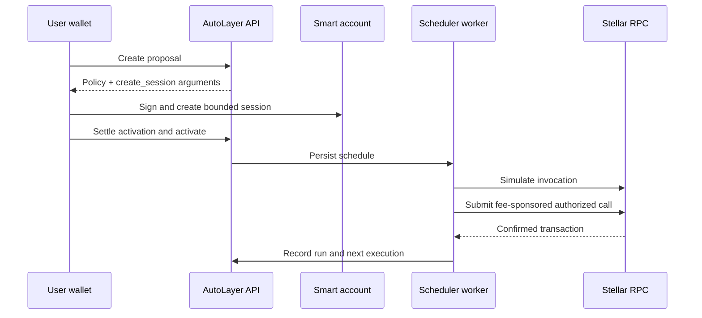

AutoLayer Runtime turns a human-readable proposal into a persisted schedule and a bounded smart-account session. The scheduler never receives the wallet owner’s secret key. A fresh encrypted delegate signs only authorizations permitted by the on-chain policy, while the paymaster submits and covers network fees.

## Supported work

| Type | Purpose | Policy boundary |
| --- | --- | --- |
| `CONTRACT_CALL` | Invoke a typed Soroban function | Exact contract and function; finite uses and ledger window |
| `DCA` | Recurring Aquarius strict-send swap | Router permission, assets, recipient, per-call and total amount |
| `REBALANCE` | Move toward target portfolio weights | Router, allowed assets, thresholds, slippage and totals |
| `DISBURSEMENT` | One-time or recurring SEP-41 transfers | Asset, recipients, per-call and aggregate spend |

## Contract interface

Contracts can expose a predictable convention:

```rust
pub trait AutoLayerKeeper {
    fn autolayer_check(env: Env) -> bool;
    fn autolayer_run(env: Env, executor: Address) -> Val;
}
```

`autolayer_check` allows discovery and simulation to determine whether work is currently eligible. `autolayer_run` performs it. Contracts must still require authorization and enforce replay, time, amount, recipient, and state invariants. See `examples/autolayer-keeper`.

## Execution flow



Pause prevents future job execution. Resume revalidates schedule eligibility. Cancel revokes future scheduling. None of these operations reverse a confirmed ledger transaction.

<Warning>A generic contract-call session currently scopes contract and function. Your contract must validate argument-sensitive financial invariants rather than assuming the scheduler is trusted.</Warning>
